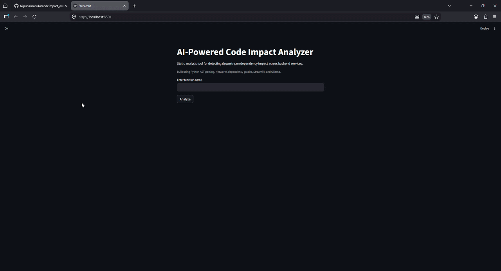

# Code Impact Analyzer

<p align="center">
  
</p>

**Code Impact Analyzer** is an AI-powered static code analysis tool designed to detect downstream dependency impacts across backend services. By mapping function relationships and using Local LLMs, it helps developers understand the "blast radius" of code changes before they are committed.

Built using **Python AST parsing**, **NetworkX dependency graphs**, **Streamlit**, and **Ollama**.

---

## 🛠 Tech Stack

* **Language:** Python 3.9+
* **UI Framework:** Streamlit
* **Graph Logic:** NetworkX & Matplotlib
* **LLM Engine:** Ollama (Local AI)
* **Analysis Engine:** AST (Abstract Syntax Tree)

---

## 📂 Project Structure

```text
CodeImpactAnalyzer/
│
├── app.py              # Main Streamlit application
├── parser.py           # AST logic for extracting functions and calls
├── graph_builder.py    # Logic for building and styling the NetworkX graph
├── analyzer.py         # Risk scoring and Ollama API integration
│
├── sample_project/     # Example directory for testing the tool
│   └── payments.py
│
├── assets/             # Documentation images and gifs
│   └── codeimpact.gif
│
└── README.md           # Project documentation
```

---

## 🚀 How to Run the Project

### 1. Clone the Repository

```bash
git clone https://github.com/your-username/CodeImpactAnalyzer.git
cd CodeImpactAnalyzer
```

### 2. Set Up a Virtual Environment

```bash
# Create environment
python -m venv venv

# Activate (Windows)
venv\Scripts\activate

# Activate (Mac/Linux)
source venv/bin/activate

# Install dependencies
pip install -r requirements.txt
```

### 3. Initialize AI Model (Ollama)

Ensure you have Ollama installed and running on your machine.

```bash
ollama pull llama3
ollama run llama3
```

### 4. Run the Application

```bash
streamlit run app.py
```

### 5. Access the Dashboard

Open your browser and navigate to:

```
http://localhost:8501
```

---

## 📖 Features

- **AST-based Code Analysis:** Automatically extracts functions and dependencies from Python code
- **Dependency Graph Visualization:** Visual representation of code dependencies using NetworkX
- **Risk Scoring:** AI-powered impact assessment using Ollama
- **Interactive Dashboard:** User-friendly Streamlit interface
- **Local LLM Integration:** Privacy-first analysis with local AI models

---

## 💡 How It Works

1. **Parse:** Extract functions and calls from Python files using AST
2. **Analyze:** Build a dependency graph to understand relationships
3. **Score:** Use local LLM to assess the impact of code changes
4. **Visualize:** Display interactive graphs on the Streamlit dashboard


